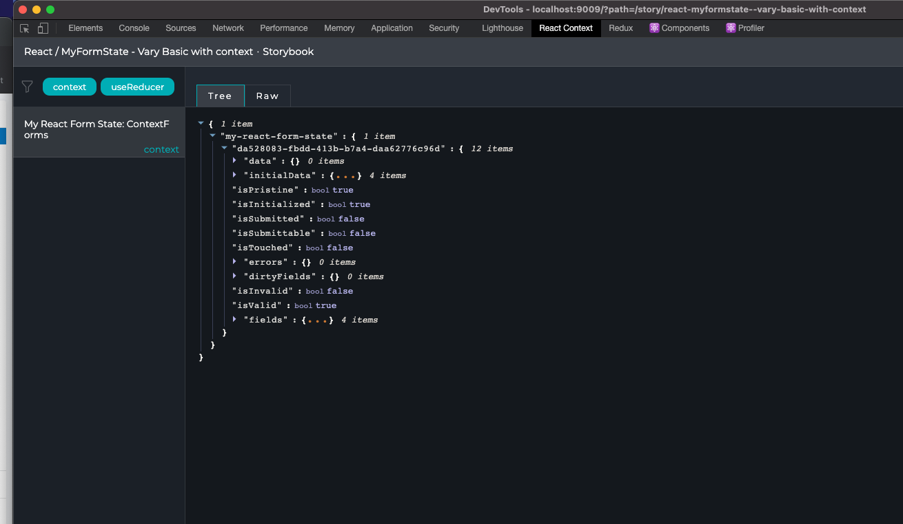

# Using React Context API

This library also works with the React Context API. Once this is defined all the forms withing a Provider will be available on that Context only.

This way we can easily share state between relevant forms. Too easy!!!!!

```js
import React from 'react';
import { MyFormStateProvider } from 'my-react-form-state/react';

const initialStateBasic = { name: 'test 1', familyName: 'test 2', alias: 'test 2', favoriteColor: 'test 4' };
const initialStateBasic2 = { name: 'test 2', familyName: 'test 66', alias: 'test 88', favoriteColor: 'test 99' };

return (
  <>
    <MyFormStateProvider name="ContextForm1AndForm2">
      <Form onSubmit={onSubmit} initialState={initialStateBasic} /> // form 1
      <Form onSubmit={onSubmit} initialState={initialStateBasic2} /> // form 2
    </MyFormStateProvider>
    <MyFormStateProvider name="ContextForm3AndForm4">
      <Form onSubmit={onSubmit} initialState={{}} /> // form 3
      <Form onSubmit={onSubmit} initialState={{}} /> // form 4
    </MyFormStateProvider>
  </>
);
```

Now form 1 and 2 will live together in the same context (now you can share data between them) and 3 and 4 will also live together in the same context.

Note: if you have [React Context google plugin](https://chrome.google.com/webstore/detail/react-context-devtool/oddhnidmicpefilikhgeagedibnefkcf?hl=en) installed now you will be able to see the sate in your chrome tool. This only apply to development mode.


